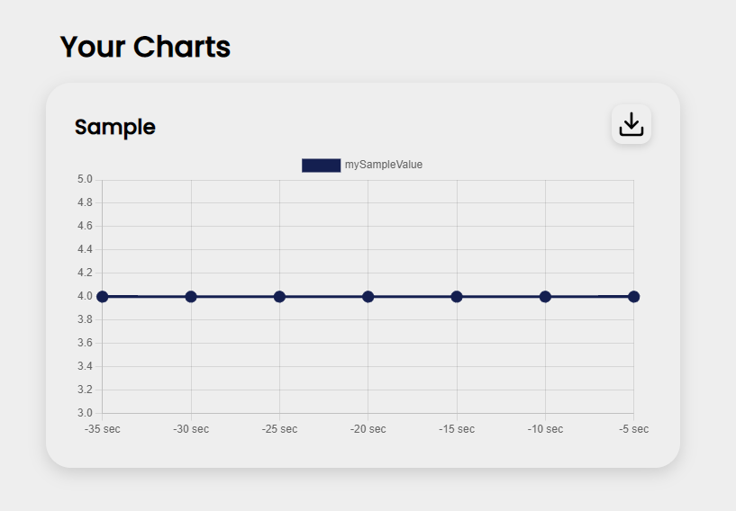

# .apirc


Here is a plain `.apirc` file
```json
{
  "freq": "5000",
  "charts": {
    "myChart1": {
      "data": [
        {
          "name": "myValue",
          "cmd": "YOUR_SHELL_COMMAND_HERE"
        }
      ]
    }
  }
}
```

* `freq`: Frequency of logs (ms)
* `charts` : Object containing named chart objects.

Multiple datasets can be added in one chart by adding to the corresponding `data` property.
Multiple charts can be added by adding to the `charts` object

<br/>

## Example

Logging a sample value, in this case, a constant 4.

```json
{
  "freq": "5000",
  "charts": {
    "Sample": {
      "data": [
        {
          "name": "mySampleValue",
          "cmd": "echo 4"
        }
      ]
    }
  }
}
```

#### logs

Logs are displayed in the console & written in the specified `.env` paths. 

```log
[2/0/2022] <17:09> mySampleValue: 4
[2/0/2022] <17:09> mySampleValue: 4
[2/0/2022] <17:09> mySampleValue: 4
[2/0/2022] <17:09> mySampleValue: 4
[2/0/2022] <17:09> mySampleValue: 4
[2/0/2022] <17:10> mySampleValue: 4
[2/0/2022] <17:10> mySampleValue: 4
```


#### Web app

The web application generates graphs which update in real time.




<br/>

#### Adding Y-value bounds

```json
"Sample": {
  "data": [
    {
      "name": "mySampleValue",
      "cmd": "echo 4"
    }
  ],
  "bounds": [0, 10]
}
```

Adding the `bounds` property will apply the bounds on the corresponding graph.


#### Responsive point size

```json
  "responsivePointSize": true
```

Adding the `responsivePointSize` property will allow for the points on the graph to scale according to the number of values present.


<br/>

# Config Templates

You can look for usable templates for your system in our `./configs` directory. 
Replace your root `.apirc` with the corresponding `./config/distro.apirc`.

If your system is not present, feel free to add it in pull request!

---

[go back](https://github.com/matiasvlevi/serverfetch)